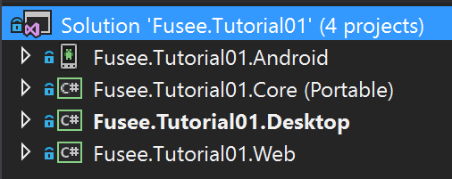
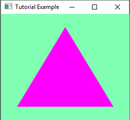

#Tutorial 01

##Goals
 - Understand how FUSEE deals with multiple platforms (desktop, web, Android).
 - Understand the basic setup of a FUSEE application.
	- Init contains initialization and startup code.
	- RenderAFrame is called repeatedly for each frame to draw.
 - Understand rendering pipeline basics.
 - Send simple geometry through the rendering pipeline.
 - Render a triangle.

##Get Started
 - Download and run the [FUSEE project] (https://github.com/FUSEEProjectTeam/Fusee) as described in [_Getting Started_] (https://github.com/FUSEEProjectTeam/Fusee/wiki/Getting-Started).
 - Open Fusee.Tutorial01.sln in Visual Studio (e.g. by double-clicking on the file).
 - The solution contains four projects
 
   
   - *Core* - contains the main functionality of the application (- the "business logic")
   - *Desktop* - contains an Application for the (Windows) desktop loading and executing the Core functionality.
   - *Web* - contains a build process creating a JavaScript cross-compiled version of the Core functionality and generating an HTML page to load and execute that functionality.
   - *Android* - contains a [Xamarin] (https://xamarin.com/) project creating an Android APK loading and executing the Core functionality.
 - Set the Desktop project as the Startup project. 
 - Right-click on the Desktop project and hit "Build".
 - If the build was successful, run the application.
 - You should see an empty application window with a greenish background.
 - If you want, also try to build the other platform Applications.
 - In the Core project, open the source code file "Tutorial.cs". This file contains the application logic (not too much at the moment...).
 - The file contains one class, `Tutorial` consisting of three methods:
   - `Init` - Called on application startup. You can place initizalization code here. Currently, `Init` just sets the clear color

     ```C#
     public override void Init()
     {
        RC.ClearColor = new float4(0.5f, 1, 0.7f, 1);
     }	
     ```

   - `RenderAFrame` - Called to generate image contents (once per frame). You can place drawing and interaction code here. Currently, `RenderAFrame` just clears the background of the backbuffer (`RC.Clear`) and copies the backbuffer contents to the front buffer `Present`.
   - `Resize` - Called when the render window is resized (or initialized). We will look at this method later.
 - Try to change the color of the render window background by altering the first three components of the `float4` value assigned to `RC.ClearColor`. These values are red, green and blue intensities in the range from 0 to 1.
   
 
##The rendering pipeline
Before we can draw some geometry, we need a simple understanding how the graphics card works. You can imgine the graphics card (or the GPU) as a pipeline. On the one end, you put in (3D-) Geometry and on the other end a rendered two-dimensional pixel image drops out. The conversion from the vector geometry into pixel images is done in two major steps: 

1. The coordinates of the geometry's vertices are converted into screen coordinates.

2. The vector geometry (in screen coordinates) is "rasterized" - that is, each pixel in the output buffer covered by geometry is filled with a certain color.

You can control both steps by placing small programs on the graphics card's processer (the GPU). These programs are called "Shaders". A program performing the coordinate transformation from whatever source-coordinate system to screen coordinates is called "Vertex Shader". A program performing the color calculation of each pixel to fill is called "Pixel Shader". In FUSEE you need to provide a Pixel and a Vertex Shader if you want to render geometry. The programming language for shaders used in FUSEE is GLSL, the shader language supported by OpenGL.

![Render and Pixel Shaders] (_images/RenderPipelineVP.png)

##Add Shaders
Now let's add a very simple pair of a Vertex- and a Pixel-Shader.
 - Add two fields to the `Tutorial` class containing strings with the respective Shader code:
	```C#
	private const string _vertexShader = @"
		 attribute vec3 fuVertex;

		void main()
		{
			gl_Position = vec4(fuVertex, 1.0);
		}";

	private const string _pixelShader = @"
		#ifdef GL_ES
			precision highp float;
		#endif

		void main()
		{
			gl_FragColor = vec4(1, 0, 1, 1);
		}";
	```
   Note that the program code (containting a `main` method each) is contained in strings. Thus, the C# compiler will not recognize its contents as program code. 
 
 - Add code to the `Init` method to compile the shader code for the GPU and set it as the currently active shader on the render context (`RC`).
	```C#
	var shader = RC.CreateShader(_vertexShader, _pixelShader);
	RC.SetShader(shader);
	```
 
Note how the pixel shader does nothing but copy the incoming vertex (`fuVertex`) to the resulting vertex (`gl_Position`) while adding a fourth dimension to it (constantly set to 1.0). The pixel shader fills each pixel it is called for (`gl_FragColor`) with a constant color (magenta - full red, no green, full blue).

##Add Geometry
 - At the `Tutorial` class level, create a private `Mesh` field. 
	```C#
    private Mesh _mesh;
	```

 - Inside the `Init` method, initialize the mesh with a a single triangle.
	```C#
	_mesh = new Mesh
	{
		Vertices = new[]
		{
			new float3(-0.75f, -0.75f, 0),
			new float3(0.75f, -0.75f, 0),
			new float3(0, 0.75f, 0),
		},
		Triangles = new ushort[] {0, 1, 2},
	};
	```

 - In the `RenderAFrame` method, draw the mesh _after_ the backbuffer was cleared, but _before_ the backbuffer contents is `Present`ed.
	```C#
	RC.Clear(ClearFlags.Color | ClearFlags.Depth);

	RC.Render(_mesh);

	Present();
	
	```
 
 - Compile and run the program for your favorite platform. A magenta colored triangle should fill the green background.
 
    
	
 - Visit the
   [result as web application] (https://cdn.rawgit.com/griestopf/Fusee.Tutorial/5658a54/Tutorial01Completed/out/Fusee.Tutorial.Web.html)
   (Ctrl-Click or Long-Press to open in new tab).
 
 - See [Tutorial.cs] (../Tutorial01Completed/Core/Tutorial.cs) in the [Tutorial01 Completed] (../Tutorial01Completed) folder for 
   the overall state so far.	

##Exercise/Questions
Investigate how the vertice's coordinates relate to pixel positions within the output window.
 
 - What are the smallest and largest x- and y-values for vertices that can be displayed within the output window?
 
 - What happens to your geometry if you re-size the output window? 
 
 - What happens if you change the z-values of your vertices (currently set to 0)?
 

Understand how the `Triangles` are indices into the `Vertices` array.
 
 - Add another vertex to the `Vertices` array. 
 
 - Add another triangle (three more indices) to the `Triangles` array to display a rectangle using four entries in `Vertices` and six entries in `Triangles`.
 
 - What happens if you change the order of the indices in the `Triangles` array? Try to explain your observation.
 
 
Understand the concept of "the current Shader".

 - Add one more geometry `Mesh` and another pixel shader string (setting a different color).
 
 - Compile another shader using the new pixel shader (and the exisiting vertex shader). Store both shaders (resulting from the two `RC.CreateShader` calls) in fields rather than in local variables. 
 
 - Within `RenderAFrame` render each of the two meshes with a different shader (call `RC.SetShader` before `RC.Render`).
 
  
 

 
