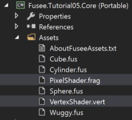
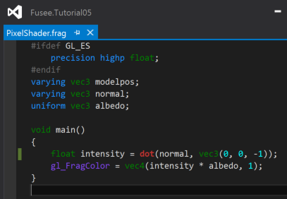
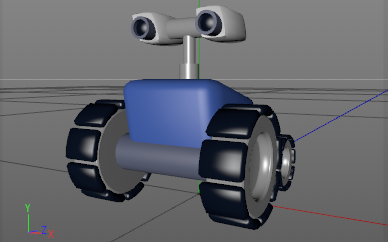
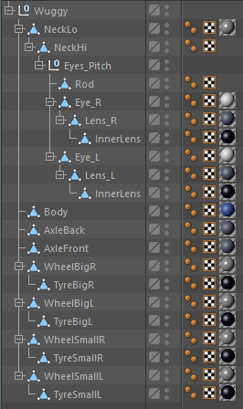
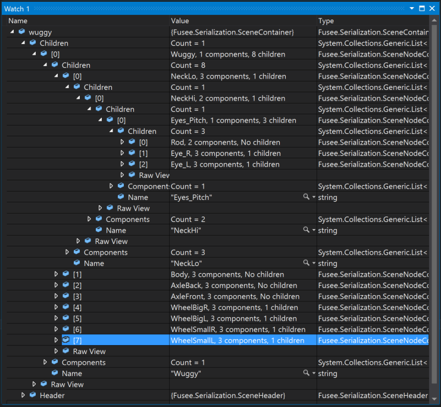
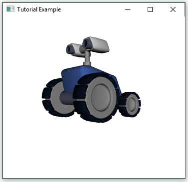
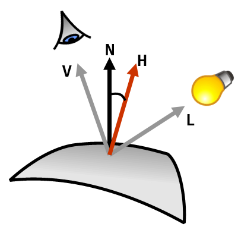
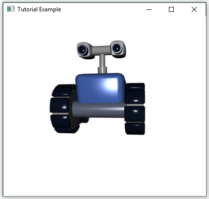

#Tutorial 05

##Goals
 - Understand FUSEE's built-in SceneGraph and traversal functionality
 - Implement a more complex shader with specular component

##Shaders are Assets now 
Build and run Tutorial 05. The output looks like we left off at [Tutorial 04](../Tutorial04). Under the hood we have one small enhancement:
Vertex and Pixel Shader are now in seperate source files: `VertexShader.vert` and `PixelShader.frag`. Both files can be found
under the `Assets` folder in the Core project.



All text files marked as `Content` with either file extension `.vert` (for vertex shader) or `.frag` (for fragment shader - the OpenGL terminology
for pixel shader) will be compiled using the [OpenGL reference compiler] (https://www.khronos.org/opengles/sdk/tools/Reference-Compiler/) *before*
the C# source code itself will be compiled. Thus you will get errors reported directly in the build output and will not have to run the program
to find any errors in your shader code wrapped in some exceptions at run-time.

In addition you might want to install the latest [release of the NShader Syntax Hilighter] (https://github.com/samizzo/nshader/releases) 
(See the [project web site] (http://www.horsedrawngames.com/shader-syntax-highlighting-in-visual-studio-2013/) for additional information).
This Visual Studio Extension produces visual support like shown below while editing your shader code:




##FUSEE's built-in SceneGraph
In Tutorial 04 we created a simple class, `SceneOb` that we used to create hierarchical scene graphs. In addition we added a method `RenderSceneOb()` 
that went through a tree of `SceneOb` instances and rendered the contents of the individual `SceneOb`s. From now on we will call the process of 
going through a hierarchy of objects ***traversing*** the tree. In addition we will call a hierarchy of objects making up parts of a 3D scene
a **Scene Graph**.

FUSEE already comes with a set of classes allowing to build up Scene Graphs. You can find these classes in the [Fusee.Serialization project]
(https://github.com/FUSEEProjectTeam/Fusee/tree/develop/src/Serialization). All classes found here can be serialized and deserialized using 
automatically generated serialization code. In Tutorial 04 you already used these classes to load a `.fus` file and retrieve some 
Mesh data out of it. But `.fus` can not only store simple meshes - it can contain complete scene graphs.

A Scene Graph in FUSEE is always a tree of `SceneNodeContainer` objects (we will just call them *nodes*). 
Take a look at the [source code] (https://github.com/FUSEEProjectTeam/Fusee/blob/develop/src/Serialization/SceneNodeContainer.cs)
and you will notice that its declaration is very short: Besides a name, each node is only made up of two lists

 1. A list of `SceneComponentContainer` objects - we will just call them *components*

 2. A list of child nodes - this is how a hierarchy can be built just with our DIYS-`SceneObs
  
Let's talk about components a little bit. In the `Fusee.Serialization` project you can find a lot of classes derived from `SceneComponentContainer`
such as

 - `MeshComponent` - you already dealt with it in Tutorial 04
 - `TransformComponent` - contains a position, rotation and scale information
 - `MaterialComponent` - contains a material description (e.g. a color)

just to name a few. These components are the building blocks containing the contents a scene is made of. Not every node must contain a comlete
set of parameters. Some nodes are just there to group other nodes, so they don't contain any component at all. Some nodes might be a group
and at the same time allow their children to be transformed simultaneously in world space, then such a node may contain a transform component only.
Other nodes contain a complete set including a mesh, a transform and a material. And as you can see, there are more types of components 
which we will not talk about during this tutorial.

On the outermost level of a `.fus` file there is always one `SceneContainer` object making the "root" of the tree. We will simply call it
a *scene*. It contains a list of `Children` of `SceneNodeContainer` objects. This is the list of nodes at the root level. In a addition a 
scene containts some header information about the `.fus` file.

To summarize, you can imagine the contents of a `.fus` file as the example tree in the following image:

![Example Tree] (_images/SceneHierarchy.png)

The orange object is the one-and-only `SceneContainer` root instance. The yellow squares are `SceneNodeContainer` objects (*nodes*) 
and the green rounded squares are different derivations of `SceneComponentContainer` instances (*components*).

The numbers are the order in which a traversal will visit each node and component. 


Now let's look at an example of a scene. The following image is a hierarchical model created in CINEMA 4D, a commercial 3D modelling software:



Here you can see the scene graph inside the modelling software:



Now we want to load this scene in our source code. Add the model file 'wuggy.fus' to the Assets sub folder in the `Fusee.Tutorial05.Core`
project and don't forget to set its properties to `Content` and `Copy if newer`. Add the following loading code to the `Init()` method of the `Tutorial` class in [Tutorial.cs] (Core/Tutorial.cs).

```C#
   SceneContainer wuggy = AssetStorage.Get<SceneContainer>("wuggy.fus");
```

Compile the code and set a breakpoint to the line right after the above. Starting the tutorial in the debugger will break at the position right
after deserializing the contents of `wuggy.fus` into an object tree. Drag the `wuggy` variable into the debugger's watch window and inspect
its contents:



###Practice
 - Draw an image of the hierarchy contained in `wuggy` using squares and circles like the image above.
 - Convince yourself about the 1:1 connection of the hierarchy in the `wuggy` variable and the scene 
   graph image from the modelling software above.
 - Look inside the various Components. What information is contained in the `MaterialComponent`, `TransformComponent` and `MeshComponent` types?
 
 
##Rendering with a Visitor 
To render a scene like the one stored in `wuggy` we need to *recursively* traverse all `Children` of the root `SceneContainer`. We already 
implemented a simple rendering traversal with our `RenderSceneOb()` method. But rendering is not the only purpose to traverse a scene. 
Here are two traversal reasons other than rendering:
 - Find a node or component based on some search criterion (e.g. all nodes with a certain name, all meshes with more than 50 triangles, etc.)
 - Picking - finding all meshes and nodes under a given position or withtin a rectangular range given in screen space, such as 
   the current mouse position.

So we now have the situation that we have a set of building blocks of different component types to build up our hierarchy and we 
also have a couple of different actions that should take place when traversing. So the action that occurs depends on two things:
 1. The type of the component being traversed
 2. The "reason" for traversing such as rendering, searching, picking, etc.
 
In computer science this problem and its solution is treated under the keyword ***Visitor Pattern***, or ***Double Dispatch***. FUSEE
comes with an implementation based on the classical Visitor Pattern and some extensions built around it to enable programmers
using scenes to easily implement their own traversals and at the same time extend the set of `SceneNodeContainer` classes for 
their own needs. These implementions around the core `SceneVisitor` class can be found in the [Fusee.Xene] (https://github.com/FUSEEProjectTeam/Fusee/tree/develop/src/Xene) subproject. You can also find some additional information in 
the [Fusee.Xene.md] (https://github.com/FUSEEProjectTeam/Fusee/blob/develop/src/Xene/Fusee.Xene.md) document.

To Implement your own Rendering Visitor you should do the following.
 
 1. Create a class derived from `Fusee.Xene.SceneVisitor` and add three visitor methods for mesh, transform and material
    components:

	```C#
	class Renderer : SceneVisitor
    {
        [VisitMethod]
        void OnMesh(MeshComponent mesh)
        {
        }
        [VisitMethod]
        void OnMaterial(MaterialComponent material)
        {
        }
        [VisitMethod]
        void OnTransform(TransformComponent xform)
        {
        }
    }
	```

	The name of the class as well as the name of the methods may vary. Note how the methods are attributed with the
	`VisitMethod` attribute and how methods vary in the different parameter types all derived from `SceneComponentContainer`.
	
 2. Add two fields to the `Tutorial` class: One to keep the `_wuggy` scene and another one to keep an instance of our newly
    created `Renderer`:
	
	```C#
	    private SceneContainer _wuggy;
        private Renderer _renderer;
	```
	
 3. In the `Init()` method load the contents of wuggy.fus into the `_wuggy` field and initiate an instance of our `Renderer`:

 	```C#
		_wuggy = AssetStorage.Get<SceneContainer>("wuggy.fus");
		_renderer = new Renderer();
	```

 4. In the `RenderAFrame()` method, somewhere between `Clear()`ing the back buffer and `Present()`ing the contents to the front
    buffer, use our `Renderer` to traverse the wuggy scene:
	
 	```C#
		_renderer.Traverse(_wuggy.Children);
	```
	
Of course our renderer doesn't do anything right now. But you can already observe him visiting the components:

###Practice
 - Build the project. Set three breakpoints - one at the closing curly brace (`}`) of each of the visitor methods `On...()` 
   defined in our `Renderer` class. Start the program and observe the mesh, material and transform components as they
   are visited. 
 - While debugging, add the identifier `CurrentNode` to the Watch window. This way you can observe which *node* the currently
   visited *component* belongs to.
 - Take your sketch of the scene graph from the previous practice block (the image with the squares and circles depicting
   wuggy's nodes and components) and identify which circle you're at while hopping from component to component using
   the `F5` key.

Now you should get the idea how you could add code to the three empty methods to add the contents of the respective
node to the render context `RC` during traversal.

There are some things missing though: Using the three methods we can now track each of the components we're interested in while
traversing. But we also need to be notified by the visitor before entering into child list and also after all children
of a child list are done visiting. In other words we want to know if another step in the depth of the hierarchy is taken
into whatever direction (in or out). Fortunately, the `SceneVisitor` class already provides this information: It calls
the method `PushState()` when going one step deeper in the hiearchy of nodes (when entering a `Children` list) and it
calls `PopState()` when all nodes in a  `Children` list have been visited and the traversal returns to the parent node.

If we want to add our own code when these events happen, all we need to do is to override these pre-defined methods. In
the `Renderer` class, add the following methods:

```C#
	protected override void PushState()
	{
	}
	protected override void PopState()
	{
	}
```
 
So altogether we should now have five empty methods in `Renderer`.
###Practice
 - Set two more breakbpoints at the closing curly braces and observe the visitor doing its work including going down and up 
   the hierarchy while looking at `CurrentNode` to see where the traversal is currently at.
 - **Advanced**. Add functionality to output a structured text with the contents of `_wuggy` with indentations showing
   the level in the hierarchy. Add some syntactic sugar to your output to yield an XML or JSON file.
 
The two newly added methods' names already show what's typically done here: We need to perform push or pop operations
on stack-like data structures keeping track of the current traversal state. For rendering we typically need to keep track
of the current model-view matrix. Why? Because as you remember from `RenderSceneOb`, every visited node contributes its 
own local transformation to the overall model-view matrix. Whenever a child list is done rendering the original model-view-matrix
needs to be restored. In our new visitor approach, the right time for restoring is in `PopState()`. But here we need to know
what the original matrix was. We can get access to the original matrix in `PushState()`.

Now let's add the missing stuff to make our `Renderer` do what it should.
 - The `Renderer` needs access to the `RenderContext` because it will need to call its methods such as `Render()` and `SetShaderParam()`.
 - We need a Stack to keep a list of matrices accessed in a "last-in, first-out" (LIFO) manner.
   The Fusee.Xene project also has some pre-fabricated building blocks for this. We will use the `CollapsingStateStack<float4x4>`
   data type. It has a `Push()` and a `Pop()` operation and we get access to the top-of-stack using the `Tos` property.
 - In the scene tree we have `MeshComponent` objects but the `RenderContext.Render()` method takes `Mesh` objects. The reason why these two
   types exist is that `MeshComponent` is implemented for serialization while `Mesh` is tied to the `RenderContext` class which knows
   about rendering. To allow applications to rely on the Serialization project only, these two types are kept separate. For every
   `MeshComponent` we encounter during traversal, we will need to create a `Mesh`. To keep the renderer from creating the same
   `Mesh`es again and again in each rendering step, we will keep a cache of already created `Mesh`es. We will implement this using
   a `Dictionary<MeshComponent, Mesh>` object.
 - For now we will only take the diffuse color from the `MaterialComponent` objects.
 
Putting it all together we will end up with a `Renderer` like that:

```C#
    class Renderer : SceneVisitor
    {
        public RenderContext RC;
        public IShaderParam AlbedoParam;
        public float4x4 View;
        private Dictionary<MeshComponent, Mesh> _meshes = new Dictionary<MeshComponent, Mesh>();
        private CollapsingStateStack<float4x4> _model = new CollapsingStateStack<float4x4>();
        private Mesh LookupMesh(MeshComponent mc)
        {
            Mesh mesh;
            if (!_meshes.TryGetValue(mc, out mesh))
            {
                mesh = new Mesh
                {
                    Vertices = mc.Vertices,
                    Normals = mc.Normals,
                    Triangles = mc.Triangles
                };
                _meshes[mc] = mesh;
            }
            return mesh;
        }

        protected override void InitState()
        {
            _model.Clear();
            _model.Tos = float4x4.Identity;
        }
        protected override void PushState()
        {
            _model.Push();
        }
        protected override void PopState()
        {
            _model.Pop();
            RC.ModelView = View * _model.Tos;
        }
        [VisitMethod]
        void OnMesh(MeshComponent mesh)
        {
            RC.Render(LookupMesh(mesh));
        }
        [VisitMethod]
        void OnMaterial(MaterialComponent material)
        {
            RC.SetShaderParam(AlbedoParam, material.Diffuse.Color);
        }
        [VisitMethod]
        void OnTransform(TransformComponent xform)
        {
            _model.Tos *= xform.Matrix();
            RC.ModelView = View * _model.Tos;
        }
    }
```


Inside `Init()` initialize some of the new renderer properties AFTER the shader initialization
```C#
	RC.SetShader(shader);
	_albedoParam = RC.GetShaderParam(shader, "albedo");	
	
	_renderer.RC = RC;
	_renderer.AlbedoParam = _albedoParam;
```


Inside `RenderAFrame()` remove rendering the `SceneOb`s from Tutorial 04 and setup the view matrix and pass it to the `Renderer` like so
```C#
	float4x4 view = float4x4.CreateTranslation(0, 0, 5)*float4x4.CreateRotationY(_alpha)*float4x4.CreateRotationX(_beta)*
					float4x4.CreateTranslation(0, -0.5f, 0);
	_renderer.View = view;
	_renderer.Traverse(_wuggy.Children);
```

Building and running this should result in the wuggy model shown.



###Practice
Understand how the renderer operates. 
 - Again, set breakpoints in all methods and step through the traversal. See how transform, mesh and material components are processed.
 - Understand what the `RC.ModelView = View * _model.Tos;` line does. Why can we find this line in `PopState()` and in `OnTransform()`?
 - Debug into `LookupMesh()`. what is the purpose of this method?
 - Look up the definition of `TransformComponent.Matrix()` inside FUSEE's sources to see that this is pretty close to what 
   our old `ModelXForm()` did.
 
##Accessing Scene Properties
Now we have a model that has a lot of parts that should be moved. Wheels should spin. The back wheels can be used to perform steering operations.
The camera eyes can be rotated along two (or three) axes and the camera mount can be extended. All this can be done now by changing 
values on transform components in the scene graph from outside. 

To access an individual model part, we can use a method similar to what we already used to find the Meshes in the very 
simple .fus files from Tutorial 04, just by accessing model parts by their names. The following nodes are 
useful candidates for changing settings on their transform components in the `wuggy.fus` file.

Node Name      | Transformations   |  Purpose
---------------|-------------------|---------------------------------
 NeckLo        |  `Translation.y`  |  Height of lower camera mount
 NeckHi        |  `Translation.y`  |  Height of upper camera mount
 NeckHi        |  `Rotation.y`     |  Heading (Yaw) of cameras
 Eyes_Pitch    |  `Rotation.x`     | Up/Down rotation (Pitch) of cameras
 WheelBigR/L   |  `Rotation.x`     | Wheel rotation of front wheels
 WheelSmallR/L |  `Rotation.x`     | Wheel rotation of back wheels
 WheelSmallR/L |  `Rotation.y`     | Steering angle of back wheels

To access the left front wheels transformation component you can declare a field to reference the transform component on the `Tutorial`
class level:
```C#
    private TransformComponent _wheelBigL;
```

Then in `Init()` right after loading the `wuggy.fus` file you can find the transform component and store a reference to it using this expression:
```C#
	_wuggy = AssetStorage.Get<SceneContainer>("wuggy.fus");
	_wheelBigL = _wuggy.Children.FindNodes(n => n.Name == "WheelBigL").First().GetTransform();
```
Translated into plain English the second line reads: "In the wuggy scene get a list of nodes called 'WheelBigL', take the first of these nodes and
retrieve the first transform component found in this node's list of components.

Finally in `RenderAFrame` we can access this transform node before rendering and add an animation to it based on the state of the `W` and `S` keys.
```C#
    _wheelBigL.Rotation += new float3(-0.05f * Keyboard.WSAxis, 0, 0);
```

Build and run the application and have fun pressing `W` and `S` to spin the front left wheel.

##More Realism by Specular Light
Now we want to blow up our shader to additionally handle a specular component of the light source which will add a bit more realism to the
resulting images. The specular component creates highlights on the surfaces by simulating mirrors of the light source(s). To get an idea how
the specular component is calculated, look at the following image:



The specular intensity at a point on the surface is high, if the angle between the surface normal (N) to the incoming light source (L) and the 
angle between N and the viewer (V) are nearly the same. In this situation the viewer can see a mirror image of the light source at the position 
on the surface. To get a measure how good this mirror condition is given, we take the half-way vector between V and L and call it H. Now we
measure the angle between H and N. If it is 0 we have a perfect mirror condition. The bigger this angle gets, the less a viewer can see the light's
mirror image on the surface. So again, we take the dot product to get a value of 1 if the angle between the two vectors H and N is 0 and which 
will be 0 if the angle is 90°. In addition, the material can define a value called "shininess" controlling how fast the intensity should 
go towards zero if the angle becomes bigger. Mathematically this can be achieved by taking the result of the dot product to the power of "shininess".

The higher the shininess the smaller and sharper the highlight is. Lower shininess values result in bigger and blurrier highlights and thus simulate
less glossy materials.

To start, we want to move all the shader related stuff from our `Init()` method to the `Renderer` since here we have a closer relation between 
the shader's parameters and the material rendering.

Add a constructor to the renderer class taking the render context as a parameter and remove all the shader initialization from `Init()`

```C#
	public Renderer(RenderContext rc)
	{
		RC = rc;
		// Initialize the shader(s)
		var vertsh = AssetStorage.Get<string>("VertexShader.vert");
		var pixsh = AssetStorage.Get<string>("PixelShader.frag");
		var shader = RC.CreateShader(vertsh, pixsh);
		RC.SetShader(shader);
		AlbedoParam = RC.GetShaderParam(shader, "albedo");
		ShininessParam = RC.GetShaderParam(shader, "shininess");
	}
```

In the `OnMaterial()` method read the shininess out of the existing material definition method and set the shininess parameter:
```C#
	void OnMaterial(MaterialComponent material)
	{
		RC.SetShaderParam(AlbedoParam, material.Diffuse.Color);
		RC.SetShaderParam(ShininessParam, material.Specular.Shininess);
	}
```

As we now we handle another shader parameter called "shininess", don't forget to declare the field `IShaderParam ShininessParam` at
the class level of `Renderer`. 

Now we can apply a couple of changes to the pixel and the vertex shader:

 - The Vertex Shader now needs to supply the position of the vertex in View coordinates because the Pixel Shader needs the position of the pixel
   in question given in view coordinates. Thus the Vertex Shader needs to transform the incoming vertex with the ModelView matrix and store
   the result in a `varying` variable called `viewpos`.
 - The pixel shader takes the interpolated `viewpos` which then holds the position of the pixel currently calculated in view coordinates. 
 - The pixel shader needs a more accurate version of the normal. Thus the normal is normalized.
 - The specular intensity is calculated as described avbove.
 - Finally the specular intensity is added to all color channels thus highlighting the calculated pixel.
 
Here are the resulting vertex and pixel shader


Vertex Shader
```C++
	attribute vec3 fuVertex;
	attribute vec3 fuNormal;
	uniform mat4 FUSEE_MVP;
	uniform mat4 FUSEE_MV;
	uniform mat4 FUSEE_ITMV;
	varying vec3 viewpos;
	varying vec3 normal;

	void main()
	{
		normal = normalize(mat3(FUSEE_ITMV) * fuNormal);
		viewpos = (FUSEE_MV * vec4(fuVertex, 1.0)).xyz;
		gl_Position = FUSEE_MVP * vec4(fuVertex, 1.0);
	}
```

Pixel Shader
```C++
#ifdef GL_ES
    precision highp float;
#endif
varying vec3 viewpos;
varying vec3 normal;
uniform vec3 albedo;
uniform float shininess;
uniform float specfactor;

void main()
{
	vec3 nnormal = normalize(normal);
	
	// Diffuse
	vec3 lightdir = vec3(0, 0, -1);
    float intensityDiff = dot(nnormal, lightdir);

	// Specular
    float intensitySpec = 0.0;
	if (intensityDiff > 0.0)
	{
		vec3 viewdir = -viewpos;
		vec3 h = normalize(viewdir+lightdir);
		intensitySpec = pow(max(0.0, dot(h, nnormal)), shininess);
	}

    gl_FragColor = vec4(intensityDiff * albedo + vec3(intensitySpec), 1);
}
```

Compiling and building all changes should result in the wuggy model shown with somehow exaggerated highlights:



 - Visit the [result as web application]
  (https://cdn.rawgit.com/griestopf/Fusee.Tutorial/2058f42/Tutorial05Completed/out/Fusee.Tutorial.Web.html) 
  (Ctrl-Click or Long-Press to open in new tab).
 
 - See [Tutorial.cs] (../Tutorial05Completed/Core/Tutorial.cs) in the [Tutorial05 Completed] (../Tutorial05Completed) folder for 
   the overall state so far.

##Exercise

 - Toy around with the specular and diffuse components in the pixel shader. 
   - See what happens if we don't normalize the interpolated normal vector. 
   - Try displaying the specular component only. 
   - Let the user interactively change the shininess component with some keys and see what happens.

 - Use the material properties `Specular.Intensity` and `Specular.Color` to reduce the highlights to the settings
   found in the material of the `.fus` file.
   
 - Create a small application allowing users to drive the wuggy model around
   - Make the wheels spin correctly according to their size and the speed of wuggy over ground
   - Make the back wheels turn according to left/right steering commands.
   - Make the cameras turn to focus a fixed position (e.g. the user). 
   - Allow the user to extend/shrink the camera mount using buttons.
   
 - Advanced: Instead of a parallel light shining in viewing direction, change the calculation to a point light
   (specified in view coordinates as a vec3 uniform variable) Animate the light position to see what`s happening.


   
   
   
   
   

   
   
   
   
   
   
   
   
   
   
   
   
   
   
   
   
   
   
   
   
   
   
   
   
   

 